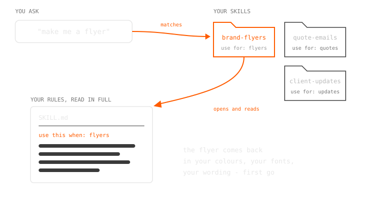

## WHAT IT IS

Every time you start a new chat with Claude, it starts from
scratch. It doesn't know your business, your rules, or the way you
like things done, so you end up typing out the same instructions
over and over again.

A skill fixes that. It's a folder with a file inside called
SKILL.md, and that file is nothing more than written instructions
for one job, done the way you want it done. The easiest way to
think about it is a handover note for a new staff member, except
you only have to write it once and it never gets forgotten.

Claude keeps all your skills together, and each one has a short
line at the top saying what kind of work it's for. When you ask
for something that matches, Claude opens the folder, reads your
instructions and follows them. You don't have to remember to
mention it, it happens on its own.

So instead of explaining how you work at the start of every chat,
you write it down once, and every chat from then on already knows.



## WHY BOTHER

Say you ask Claude to make you a flyer. Without a skill it comes
back looking nothing like your business - wrong colours, wrong
font, wording that sounds like somebody else. So you dig out the
style guide, paste it in and explain what needs fixing. Half an
hour later you finally get there. Next week you need a price
list and the whole dance starts again.

Most people assume the fix is memory because surely by now the
thing should just learn how you like your work done. These tools
do have memory but it works like one of your mates writing down
their observations of you based on what you tell them. They
decide what goes in the notes and they keep the gist rather than
your exact words (and you never quite know which notes they'll
bring out on the day). That's fine for remembering roughly what
you're about but it's no way to store the rules your business
runs on.

A skill is the opposite. It isn't their notes about you - it's
your manual handed over in your exact words and read in full
every time that job comes up. Put your rules in a skill and the
first version of that flyer comes back in your colours, your
fonts and your wording. Next week's price list matches without
you saying a thing.

And it isn't just about saving yourself the typing. Anyone you
share the skill with gets the same standard so the work comes out
the same no matter who asks, today or six months from now.

## HOW TO MAKE ONE

1. Pick one job you keep explaining. The best first skill is
   something you do every week and describe the same way every
   time - flyers, quotes, replies to a certain type of email.

2. Write the instructions like a handover note for a new staff
   member. What the job is, the rules that always apply, what the
   finished thing should look like and anything you never want to
   see. Plain words. If a style guide or a good past example
   exists, the important bits go in here too.

3. Package it the way Claude expects. A skill is a folder named
   after the job with one file inside called SKILL.md. At the top
   of that file sits a name and a one line description, and that
   description is the trigger - it's the line Claude reads when
   deciding whether this skill matches what you just asked for.

4. The lazy way (and honestly the best way) is to ask Claude to
   build it. Explain the job and your rules in a normal chat, then
   say "package that up as a skill". It hands back a finished
   skill file with a save button on it, and that button is the
   whole install.

5. Or install it yourself. In claude.ai skills are added under
   Settings on your account. In Claude Code the folder just sits
   in .claude/skills on your machine.

6. Test it by asking for the job without mentioning the skill. If
   it doesn't kick in, the description line isn't clear enough
   about when to use it - sharpen that one line and try again.

## THE STARTER

Copy this, fill in the placeholders (each one tells you what to
put there) and you've got a working skill.

```
---
name: <the job, one or two lowercase words joined by hyphens, e.g. quote-emails>
description: <one sentence saying when this skill should be used - name the job and the words someone would actually say when asking for it>
---

# <The job name again, written normally>

<One line on what this skill produces.>

## The rules
- <A rule that must always be followed>
- <Another rule>
- <Something you never want in the output>

## What good looks like
<A short example of the finished product you were happy with, or
describe it - the closer to a real one, the better.>
```
